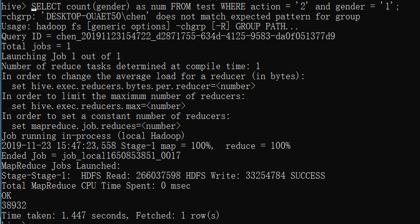

# （作业8也提交在这里） 实验3： MapReduce和Spark编程实验
## 1. 实验任务
1. MapReduce：
   - 统计各省的双十一前十热门关注产品（“点击+添加购物车+购买+关注”总量最多前10的产品）
   - 统计各省的双十一前十热门销售产品（购买最多前10的产品）
2.  Hive
   - 把精简数据集导入到数据仓库Hive中，并对数据仓库Hive中的数据进行查询分析
   - 查询双11那天有多少人购买了商品
   - 查询双11那天男女买家购买商品的比例
   - 查询双11那天浏览次数前十的品牌
3. Spark：
   - 统计各省销售最好的产品类别前十（销售最多前10的产品类别）
   - 统计各省的双十一前十热门销售产品（购买最多前10的产品）-- 和MapReduce作业对比结果
   - 查询双11那天浏览次数前十的品牌 -- 和Hive作业对比结果
4. 数据挖掘：
   - 针对预处理后的训练集和测试集，基于MapReduce或Spark MLlib编写程序预测回头客
   - 评估预测准确率
## 2. 实验环境
- Java 1.8+
- Hadoop 3.2.x
- Spark 2.4.x
- Hive 2.3.x

## 3. 实验过程
3.1  MapReduce（代码分别见Attention.java和Sell.java）

* 统计各省的双十一前十热门关注产品

  

```
命令行参数：<输入文件路径>
```

* 统计各省的双十一前十热门销售产品

  

```
命令行参数：<输入文件路径>
```

3.2  Hive：

* 把精简数据集导入到数据仓库Hive中

  

* 查询双11那天有多少人购买了商品
  ```
  SELECT count(DISTINCT userid) as num FROM test WHERE action = '2';
  ```
  输出37202
  
  
  
* 查询双11那天男女买家购买商品的比例
  ```
  SELECT count(gender) as num FROM test WHERE action = '2' and gender = '0';
  SELECT count(gender) as num FROM test WHERE action = '2' and gender = '1';
  ```
  分别输出38932和39058
  
  
  
  
  
* 查询双11那天浏览次数前十的品牌
  ```
  SELECT count(*) as num brandid as bid FROM test WHERE action = '0' GROUP BY brandid ORDER BY num DESC;
  ```
  | 数量  | 品牌 |
  | ----- | ---- |
  | 49151 | 1360 |
  | 10130 | 3738 |
  | 9719  | 82   |
  | 9426  | 1446 |
  | 8568  | 6215 |
  | 8470  | 1214 |
  | 8282  | 5376 |
  | 7990  | 2276 |
  | 7808  | 1662 |
  | 7661  | 8235 |
  

3.3  Spark（代码见task3.py）

* 统计各省销售最好的产品类别前十（销售最多前10的产品类别）

  

* 统计各省的双十一前十热门销售产品（购买最多前10的产品）-- 和MapReduce作业对比结果

  

* 查询双11那天浏览次数前十的品牌 -- 和Hive作业对比结果

  

3.4  数据挖掘（代码见task4.py）：

   - 使用MLlib中Logistic、SVM、NaiveBayes和RandomForest编写程序

   - 使用 用户年龄段、性别和卖家id 进行预测

- 将train_after按照70%:30%划分成训练集和测试集

- 使用accuracy_score对预测的准确率进行评估

- 通过**改变训练集中正反例的比例**，每个算法训练十个模型，绘出训练集中正反例比例与预测的准确率的图像

  

  

- data.txt是对test_after的预测

  
